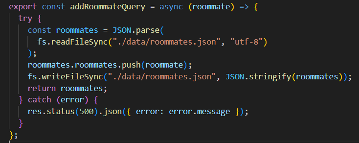
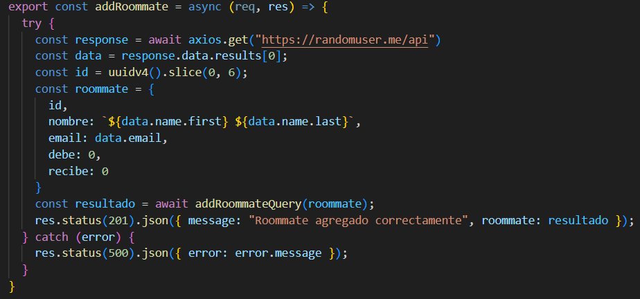

# Desafío Evaluado "Roommates"

Levantar servidor con Node cuya temática está basada en el registro de gastos entre roommates. 
## Descripción del proyecto

Mediante el módulo FileSystem se leen, escriben y almacenan archivos en formato JSON, mediante un formulario HTML.

## Capturas de Pantalla del Proyecto

Agregar nuevo roommate (models/queries.js)

Agregar nueva roommate (controllers/controller.js)


Registros de Roommates (models/queries.js)

Registros de Roommates (controllers/controller.js)


Agregar nuevo gasto (models/queries.js)

Agregar nueva gasto (controllers/controller.js)


Registros de gastos (models/queries.js)

Registros de gastos (controllers/controller.js)


Editar gasto (models/queries.js)

Editar gasto (controllers/controller.js)


Eliminar gasto (models/queries.js)

Eliminar gasto (controllers/controller.js)


Calcular gastos (models/queries.js)


## Prerrequisitos o Dependencias

Lista de software y herramientas, incluyendo versiones, que necesitas para instalar y ejecutar este proyecto:

- Node Js
- Express
- UUID
- Axios

## Instalación del Proyecto

Una guía paso a paso sobre cómo configurar el entorno de desarrollo e instalar todas las dependencias.

```bash
npm init -y
```

```bash
npm i express axios uuid
```

## Realizador del proyecto

* **Natalia García** - [GitHub](https://github.com/ngarciab22)

## Licencia

Este proyecto está bajo la Licencia MIT - ve el archivo [license](license) para más detalles.